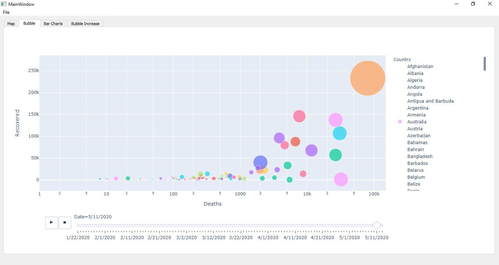
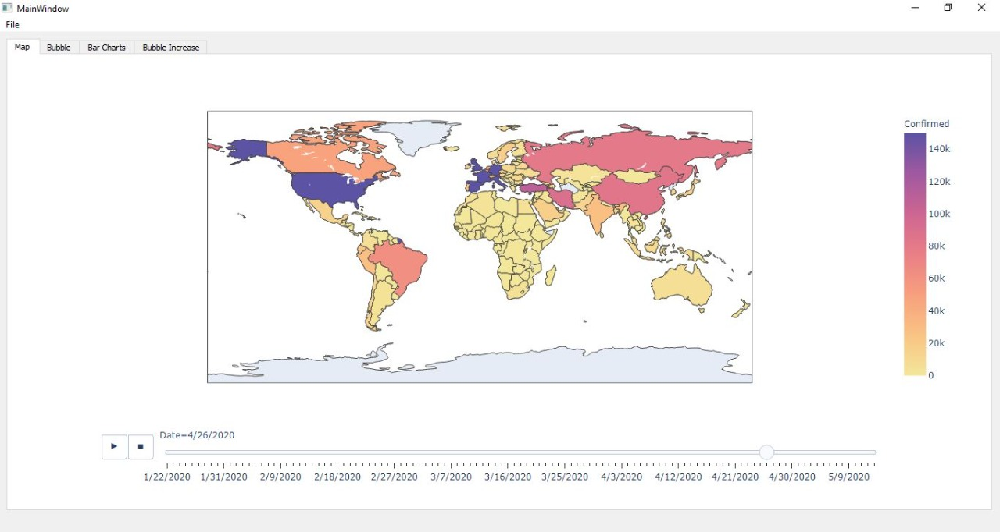
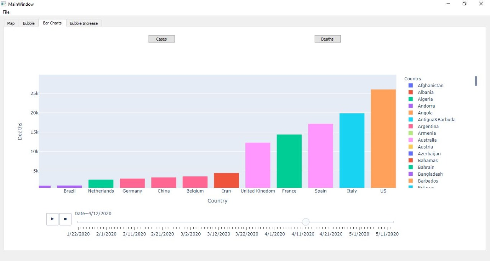
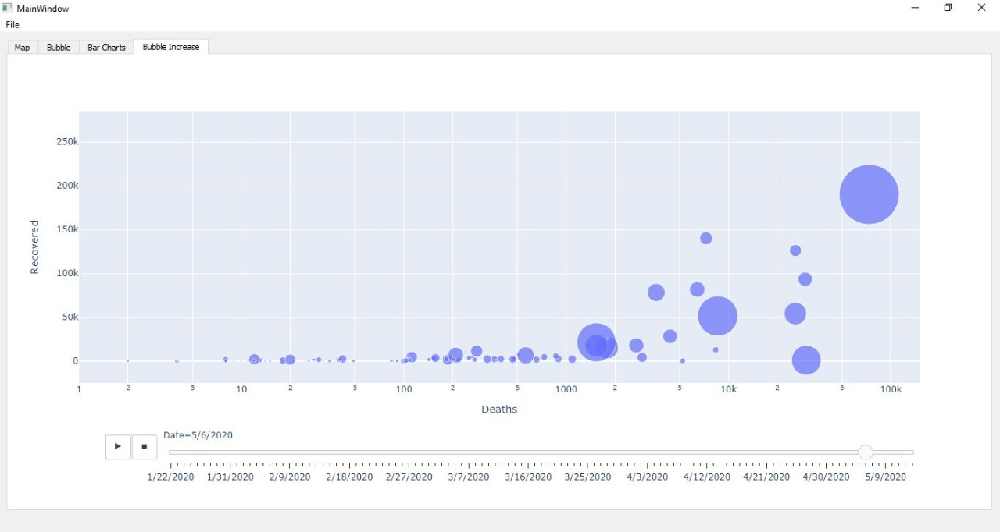
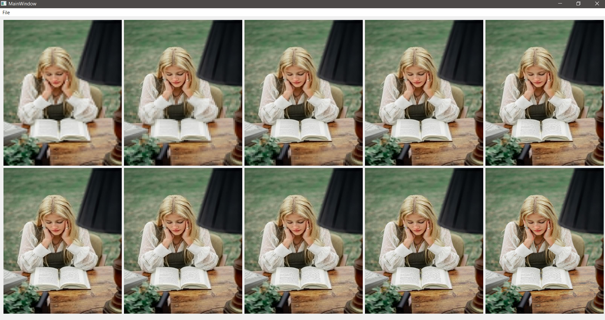

## **Graphics-final-project**

## *Group ID: 27*


  Name    |  SEC     |  BN   | MAIL  
  --------|----------|-------|---  
  Ahmed Adel | 1 | 6 |   ahmed12365488@gmail.com
  Remon Alber  |  1 | 31  |    remonalbear522@gmail.com
  Fady Tadrous | 2 | 13 | fadytadrous.ft@gmail.com
  Mohamed Almotasem | 2 | 18  |   mohammed.almotasem55@googlemail.com

### *Repository Link:*
```
https://github.com/sbme-tutorials/sbe309-2020-final-assignment-27_sbe309_20_final
```
<!-- MarkdownTOC -->

- [*Project1*](#Project1)
  - [*COVID-19 Data Visualization*](#covid-19-data-visualization)
  - [*Files written*](#files-written)
  - [*Results*](#results)
  - [*Note*](#note)
- [*Project2*](#Project2)
  - [*Progressive JPEG Decompression*](#progressive-jpeg-decompression)
  - [*Files written*](#files-written-1)
  - [*Results*](#results-1)
- [*Project3*](#Project3)
  - [*Musical Instruments Modeling*](#musical-instruments-modeling)
  - [*Files written*](#files-written-2)
  - [*Results*](#results-2)
- [*Project4*](#Project4)
  - [*Blind Source Separation*](#blind-source-separation)
  - [*Files written*](#files-written-3)
  - [*Results*](#results-3)
- [*Project5*](#Project5)
  - [Shazam](#shazam)
  - [Files written:](#files-written)
  - [Results:](#results)
- [*Project6*](#Project6)
  - [Shazam](#shazam)
  - [Files written:](#files-written)
  - [Results:](#results)
<!-- MarkdownTOC -->

# *Project1*  
## *COVID-19 Data Visualization*
the aim of the task is to acquire data to the pandemic conquering the world nowdays and try to visualize it in different ways according to the user choice which could help him in understanding the speed of its spreading and allow decision makers grasp the underlying informayion.

## *Files written*

* Gui.py : a python script contain our ui implemntation
* covid-19.py : a python script contain the algorithm used to visualize the data into the required plots
* covid-19.csv : a csv file contains the data of all countries that have been hit with the pandemic since day 1 till the past 3 weeks


## *Results*





## *Note*
In case of Having any error during the conversion process type this command into your conda prompt/ pip terminal
```
Orca serve
```

# *Project2*  
## *Progressive JPEG Decompression*
the aim of the task is to implement an algorithm to allow the user to understand the Jpeg compression and value it as one of the applications to the Fourier transform By displaying the process of decompressing the selected image into many steps all showed to the user, It will also allow him to see the advantage of the progressive type over the the baseline one at times of slow internet connection

## *Files written*

* jpeg.py : a python script contain our ui implemntation
* main.py : a python script contain the algorithm used to upload an image and decode it through 10 steps, display those steps and allow the user to save them
* image-folder : where the saved images to the steps of decoding will be saved


## *Results*



# *Project3*  
## *Musical Instruments Modeling*
the aim of the task is to implement a simple simualtion of two medical instrumentation (A piano and a guitar), By using an algorithm or a library that can imitate their sounds and generate them using filters and mixers

## *Files written*

* gui.py : a python script contain our ui implemntation
* mainP3.py : a python script contain the algorithm that will allow the user to experience the imitation to the different sounds and notes that can be produced from a guitar and a piano


## *Results*


# *Project4*  
## *Blind Source Separation*
the aim of the task is to implement an algorithm that uses tools like "Independent Component Analysis (ICA)" in order to acheive blind separation which can be used in our application to allow the user into dismantling a song into its music and vocals, separting certain voice and isolating noises in a voice recording or a coctail party voice mixture or comparing abnormal medical signals to correctly anlayze a patient.

## *Files written*

* separation.py : a python script contain our ui implemntation
* separationMethod.py : a python script contain the algorithm that allows the user to do the blind separation process to a song, a coctail voice mixture or to an ecg signal.
* ECGsignal.csv / song.wav / mixedX,Y.wav : data used to test the different tasks in our app


## *Results*


# *Project5* 
## *Shazam*
 Our application simulates real-life programs like shazam that helps the user in finding a certain song or melody that he/she is looking for by comparing an input audio given by the user that is related to the required song, Our application then runs a certain algorithm that handles the frequencies of the input and compares it to our database in order to find the required song


## *Files written*
* gui.py : it contains the GUI design created by the Qt designer
* shazam.py : the file contains the program class that handles the comparison between the input and he database
* script.py : a file contains an algorithm that reads the songs and create it's spectrogram and features
* dist folder: it contains the executable version of our shazam program from there a user can run the program in a friendly way

## *Results*
The program results are considered satisfying as it preserves the goal of giving the nearest song or melody found on the database by checking the similarity (ie. taking the difference) between the input spectrogram and those in the database and choosing the most similar one to the input


* Spectrograms:
  
   


